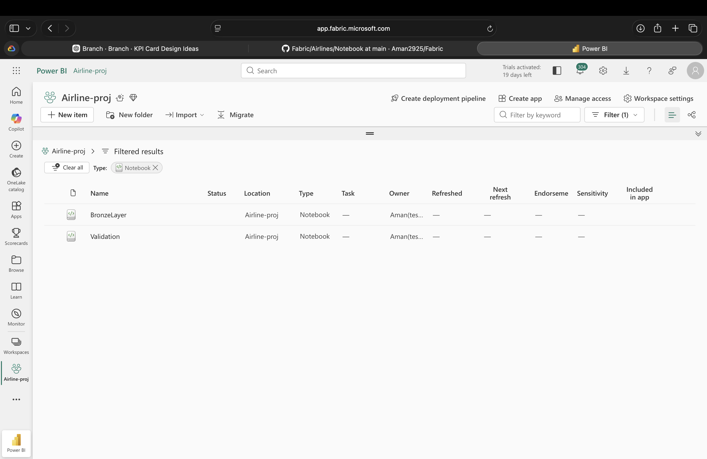
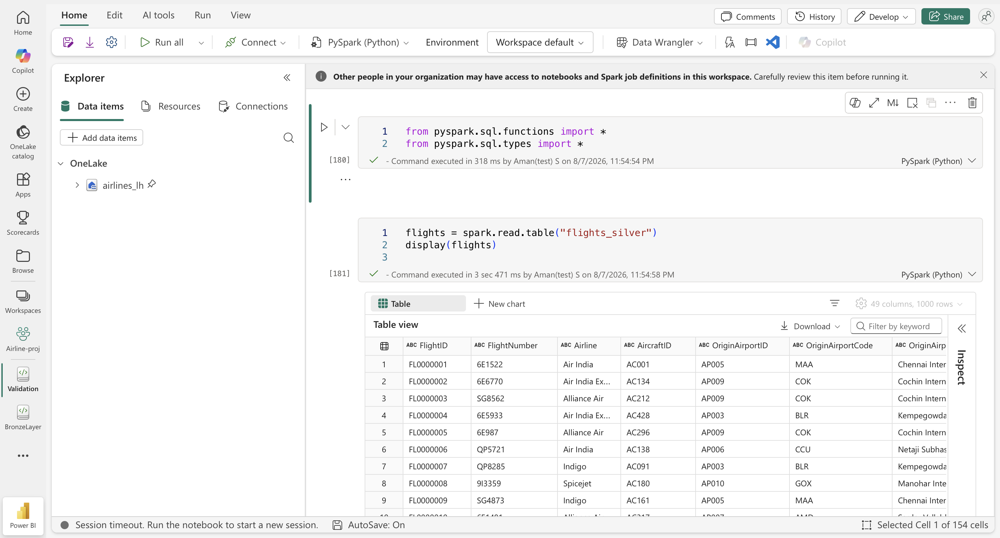
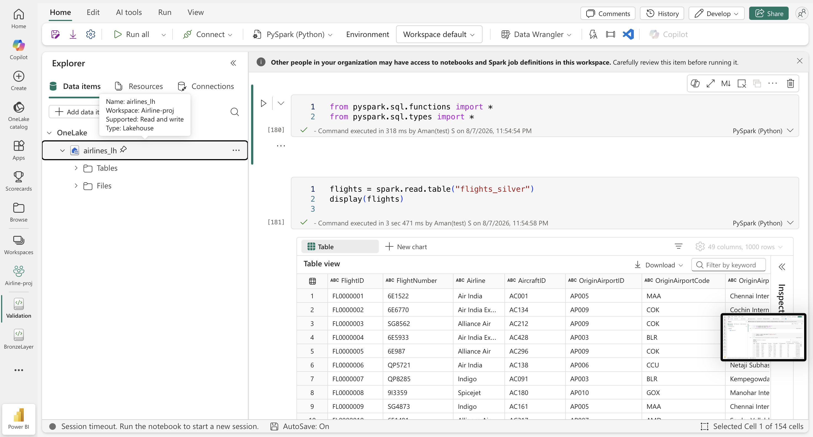
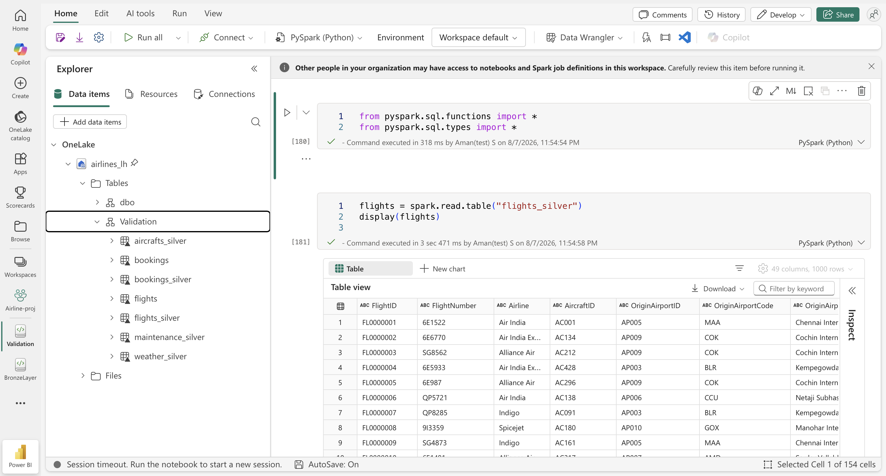
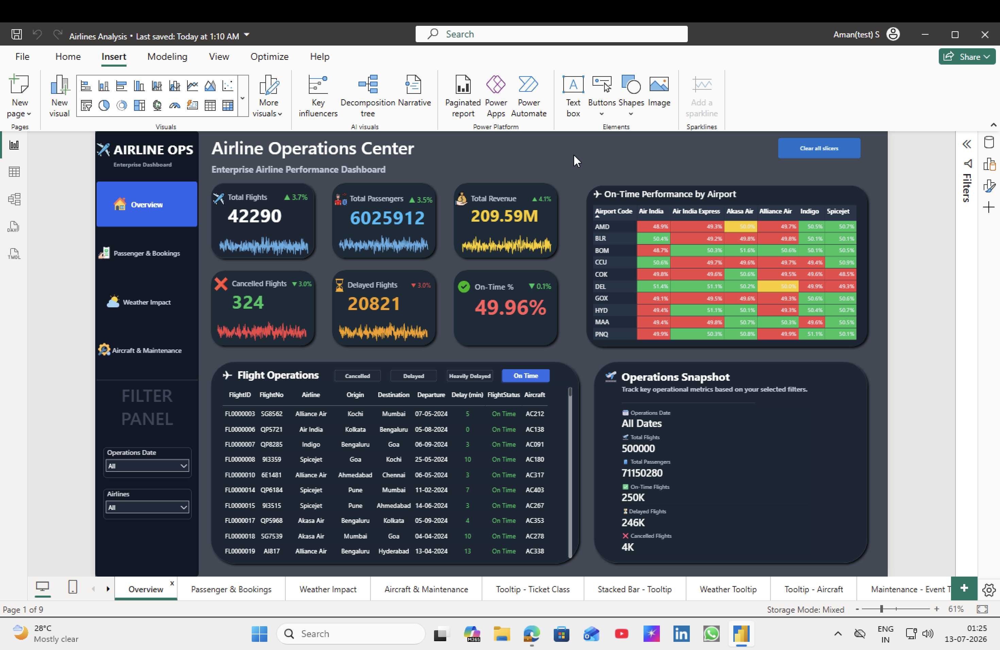
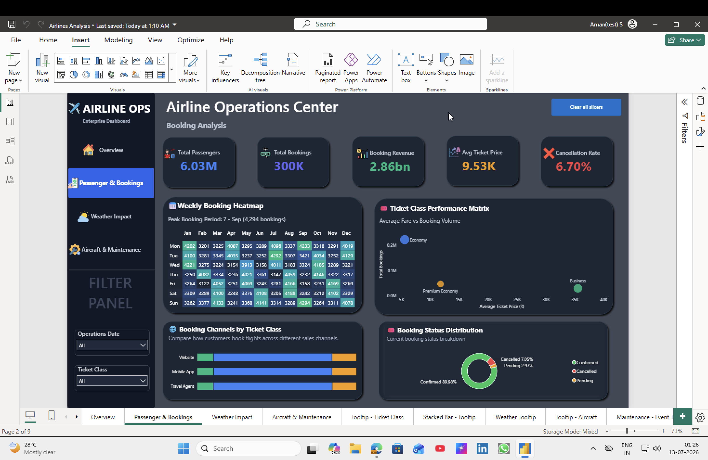
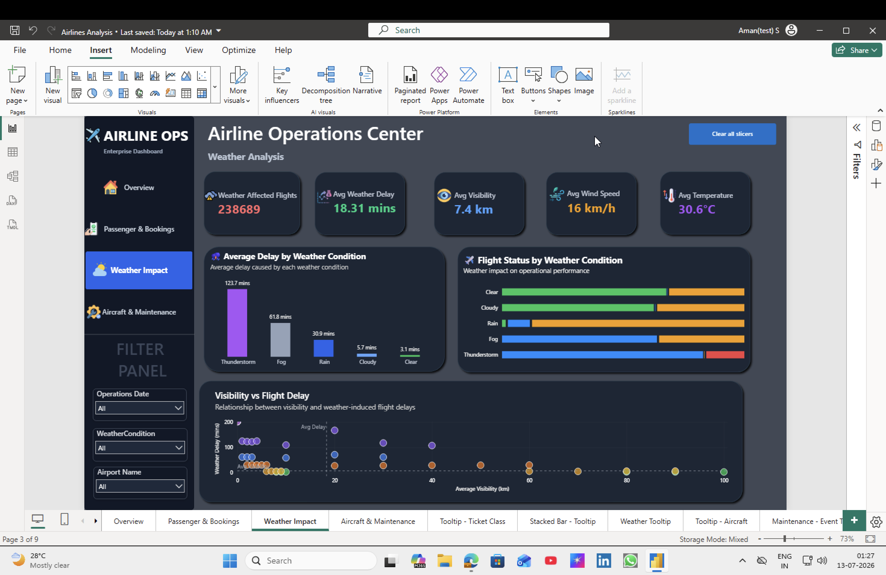
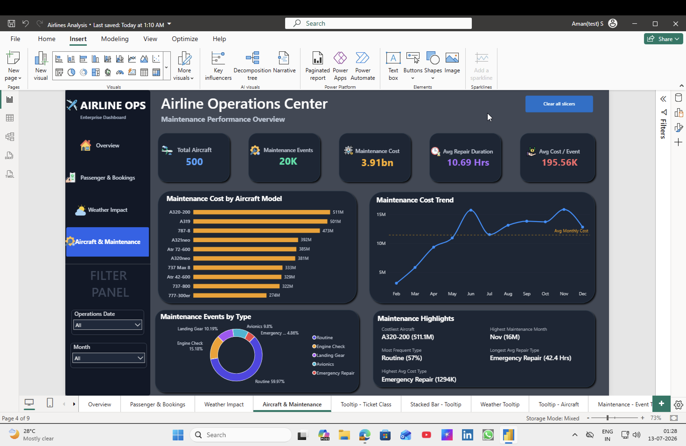

<div align="center">

# ✈️ End-to-End Airline Operations Analytics Platform
### Microsoft Fabric • Apache Spark • Lakehouse • Semantic Model • Power BI

<p align="center">


</p>

---

### 🚀 End-to-End Data Engineering & Business Intelligence Project built using Microsoft Fabric

**From Synthetic Data Generation → Lakehouse → Spark Data Validation → Delta Tables → Semantic Model → Executive Power BI Dashboard**

---

</div>

# 📌 Project Overview

Modern airlines generate millions of operational records every day across multiple business systems including flight operations, passenger bookings, aircraft maintenance and weather monitoring.

This project demonstrates how these independent datasets can be transformed into a centralized analytics platform using **Microsoft Fabric's Medallion Architecture**.

Instead of building only a Power BI dashboard, this project covers the complete analytics lifecycle:

- Python-based synthetic data generation
- Bronze layer ingestion into Microsoft Fabric Lakehouse
- Data quality validation using Apache Spark notebooks
- Silver layer transformation into Delta Tables
- Gold layer semantic modeling
- Interactive Power BI executive dashboards

The final solution enables operational reporting, KPI monitoring and business decision-making using a scalable modern data platform.

---

# 🎯 Business Problem

Airline operations rely on data coming from multiple independent systems.

These datasets often contain:

- Missing values
- Duplicate records
- Invalid timestamps
- Incorrect delay values
- Inconsistent data types
- Data quality issues

Without proper validation and transformation, business reports become unreliable and decision-making suffers.

This project demonstrates how a modern data engineering pipeline can solve these challenges using Microsoft Fabric while delivering trusted business insights through Power BI.

---

# ⭐ Project Highlights

| Metric | Value |
|---------|-------|
| ✈ Flights Generated | **500,000** |
| 🎟 Bookings Generated | **300,000** |
| 🌦 Weather Records | **100,000** |
| 🔧 Maintenance Records | **20,000** |
| 🛫 Aircraft Records | **500** |
| 🌍 Airports | **150** |
| 🏗 Architecture | **Medallion (Bronze → Silver → Gold)** |
| 📊 Dashboard Pages | **4** |
| 📈 DAX Measures | **40+** |
| 🧹 Spark Validation Rules | **Multiple Business Rules** |
| 💡 Custom Tooltips | **Yes** |

---

# 🏗 Solution Architecture

```text
                         Python Dataset Generator
                                   │
                                   ▼
                    ┌──────────────────────────────┐
                    │      Raw CSV Datasets        │
                    └──────────────────────────────┘
                                   │
                                   ▼
               ┌──────────────────────────────────────┐
               │      Microsoft Fabric Lakehouse      │
               │          Bronze Layer (Raw)          │
               └──────────────────────────────────────┘
                                   │
                                   ▼
                 Apache Spark Validation Notebook
          • Null Validation
          • Duplicate Detection
          • Data Type Standardization
          • Business Rule Validation
          • Error Logging
                                   │
                                   ▼
               ┌──────────────────────────────────────┐
               │      Silver Layer (Delta Tables)     │
               └──────────────────────────────────────┘
                                   │
                                   ▼
                    Semantic Model (Gold Layer)
                                   │
                                   ▼
                    Interactive Power BI Dashboard
```

---

# 🧰 Technology Stack

| Category | Technologies |
|-----------|--------------|
| Programming | Python, SQL, DAX |
| Data Engineering | Microsoft Fabric, Apache Spark, PySpark |
| Storage | OneLake, Lakehouse, Delta Tables |
| Analytics | Power BI, Semantic Model |
| Data Processing | Pandas, NumPy |
| Version Control | Git, GitHub |

---

# 📂 Dataset Overview

The project consists of six interconnected datasets that simulate real-world airline operations.

| Dataset | Description | Records |
|----------|-------------|--------:|
| Flights | Flight operations and delays | 500,000 |
| Bookings | Passenger reservations | 300,000 |
| Weather | Airport weather observations | 100,000 |
| Aircraft | Fleet information | 500 |
| Maintenance | Aircraft maintenance history | 20,000 |
| Airports | Airport master data | 150 |

---

# 📥 Project Resources

| Resource | Link |
|----------|------|
| 📦 Raw Dataset | https://drive.google.com/drive/folders/126ZXwdeAf4wsEgiyyLBDwlhtFlwK85wo?usp=share_link |
| 📊 Power BI (.pbix) | https://drive.google.com/file/d/1x7vI15eSXiRrgIDxaaebuZy7Z-3y4LYO/view?usp=sharing |
| 💻 GitHub Repository | https://github.com/Aman2925/Fabric/tree/main/Airlines |
---


# 🏭 Data Engineering Workflow

The project follows the **Medallion Architecture** to progressively improve data quality and prepare trusted datasets for business reporting.

The architecture is divided into three layers:

| Layer | Purpose |
|--------|---------|
| 🥉 Bronze | Store raw source data without modification |
| 🥈 Silver | Clean, validate and standardize the datasets |
| 🥇 Gold | Create a business-ready semantic model for reporting |

---

# 🐍 Synthetic Dataset Generation

Since publicly available airline datasets rarely contain all the entities required for an end-to-end analytics solution, a complete synthetic data generation framework was developed in Python.

Each dataset was generated independently while maintaining realistic relationships across entities such as flights, bookings, aircraft, airports, maintenance records and weather conditions.

### Generated Datasets

| Dataset | Description |
|----------|-------------|
| Flights | Flight schedules, delays, cancellations, operational metrics |
| Bookings | Passenger bookings, fares, ticket classes and booking channels |
| Aircraft | Fleet information including aircraft models and operational details |
| Maintenance | Maintenance history, repair duration and maintenance costs |
| Weather | Airport weather observations including visibility, wind speed and temperature |
| Airports | Airport master data used across the project |

The data generation scripts are available inside the **Dataset-Generator** folder.

---

# 🥉 Bronze Layer – Raw Data Ingestion

The first stage of the pipeline loads raw CSV datasets into the Microsoft Fabric Lakehouse without applying any transformations.

### Objectives

- Preserve the original source data
- Maintain schema consistency
- Create a landing zone for downstream processing
- Support data lineage and traceability

### Bronze Layer Workflow

```text
Python Generator
        │
        ▼
Raw CSV Files
        │
        ▼
Microsoft Fabric Lakehouse
        │
        ▼
Bronze Tables
```

### Bronze Layer Components

- Lakehouse
- OneLake Storage
- Raw CSV Files
- Spark Notebook

---

## 📸 Bronze Layer


---

# 🥈 Silver Layer – Data Validation & Transformation

The Silver layer is responsible for transforming raw operational data into clean, reliable datasets suitable for analytics.

Apache Spark notebooks were used to perform data validation, cleansing and standardization.

Unlike simple ETL pipelines, each dataset was validated using business-specific rules before being promoted to the Silver layer.

---

## 🔍 Data Quality Validation

The following validation rules were implemented throughout the pipeline.

### ✅ Null Value Validation

Missing values were identified and handled appropriately to ensure complete business reporting.

---

### ✅ Duplicate Detection

Duplicate records were detected and removed to eliminate reporting inconsistencies.

---

### ✅ Data Type Standardization

Columns were converted into their appropriate data types including:

- Integer
- Decimal
- Date
- Timestamp
- Boolean

---

### ✅ Date Validation

Date formats were standardized across all datasets to ensure consistent temporal analysis.

---

### ✅ Business Rule Validation

Several business rules were applied during validation, including:

- Negative delay values removed
- Invalid timestamps corrected
- Invalid maintenance records filtered
- Incorrect operational values identified
- Flight status validation
- Weather consistency validation

---

### ✅ Error Logging

Instead of silently removing invalid records, dedicated validation tables were created to capture rejected records for auditing purposes.

Example:

- flights_validationerrors
- bookings_validation_errors
- maintenance_validation_errors
- weather_validation_errors
- aircraft_validationerrors

This approach improves transparency while maintaining clean analytical datasets.

---

## Silver Layer Workflow

```text
Bronze Tables
        │
        ▼
Spark Validation Notebook
        │
        ▼
Data Cleansing
        │
        ▼
Business Rule Validation
        │
        ▼
Delta Tables
```

---

## 📸 Validation Notebook



---

## 📸 Silver Layer







---

# 🥇 Gold Layer – Business Modeling

After completing data validation, the cleaned Delta Tables were promoted into the Gold layer for reporting.

The Gold layer focuses on business consumption rather than data cleansing.

### Gold Layer Activities

- Semantic Model Creation
- Relationship Modeling
- Business-Friendly Schema
- Optimized Data Types
- DAX Measures
- Report Performance Optimization

The Gold layer serves as the single source of truth for Power BI reporting.

---

## Semantic Model

The Semantic Model provides a centralized business layer by defining relationships between operational entities.

Key benefits include:

- Simplified report development
- Reusable business measures
- Faster dashboard performance
- Consistent business logic

---

## 📸 Semantic Model


---

# 🔄 Microsoft Fabric Pipeline

A Microsoft Fabric Data Pipeline was designed to orchestrate the complete workflow from data ingestion to analytical consumption.

The pipeline ensures a structured execution sequence and supports reproducible processing.

Pipeline Stages:

1. Raw Data Ingestion
2. Bronze Layer Storage
3. Spark Validation Notebook
4. Silver Delta Tables
5. Semantic Model Refresh
6. Power BI Reporting

---

## 📸 Fabric Pipeline


---

# ✅ End-to-End Workflow

```text
Python Scripts
      │
      ▼
Raw CSV Files
      │
      ▼
Bronze Lakehouse
      │
      ▼
Spark Validation Notebook
      │
      ▼
Silver Delta Tables
      │
      ▼
Semantic Model
      │
      ▼
Power BI Dashboard
```

# 📊 Executive Dashboard Showcase

The final Power BI solution consists of four interactive report pages designed to monitor airline operations from multiple business perspectives.

The dashboard combines advanced DAX measures, interactive filtering, report page tooltips and executive visualizations to provide actionable insights.

---

# 🏠 Dashboard 1 — Executive Overview

The Executive Overview page provides a high-level operational snapshot of airline performance.

It enables business users to quickly monitor operational KPIs, airport performance and daily flight activity.

### Key KPIs

- ✈️ Total Flights
- 👥 Total Passengers
- 💰 Total Revenue
- ❌ Cancelled Flights
- ⏰ Delayed Flights
- ✅ On-Time Performance

### Business Insights

- Daily operational performance
- Airport-wise on-time performance
- Flight delay trends
- Operational snapshot
- Flight level drill-down

### Key Features

- Dynamic KPI Cards
- Interactive Flight Details
- Airport Heatmap
- Conditional Formatting
- Interactive Filters

---

## 📸 Executive Overview



---

# 👥 Dashboard 2 — Passenger & Booking Analytics

This page focuses on passenger behaviour, booking performance and revenue generation.

The dashboard enables commercial teams to analyze ticket sales, booking channels and customer booking trends.

### Key KPIs

- Total Passengers
- Total Bookings
- Booking Revenue
- Average Ticket Price
- Cancellation Rate

### Business Insights

- Passenger distribution
- Revenue analysis
- Booking channel performance
- Ticket class analysis
- Weekly booking trends

### Key Visuals

- Booking Heatmap
- Revenue Matrix
- Ticket Class Bubble Chart
- Booking Channel Analysis
- Booking Status Distribution

---

## 📸 Passenger & Booking Dashboard



---

## 📸 Interactive Tooltip


---

# 🌦 Dashboard 3 — Weather Impact Analysis

Weather conditions directly influence airline operations.

This dashboard evaluates how weather affects delays, cancellations and operational efficiency.

### Key KPIs

- Weather Affected Flights
- Average Weather Delay
- Average Visibility
- Average Wind Speed
- Average Temperature

### Business Insights

- Delay by weather condition
- Weather operational impact
- Visibility vs delay relationship
- Flight status under different weather conditions

### Key Visuals

- Scatter Plot
- Weather Delay Analysis
- Operational Impact Chart
- Weather Distribution

---

## 📸 Weather Dashboard



---

## 📸 Interactive Tooltip


---

# 🔧 Dashboard 4 — Aircraft & Maintenance

Aircraft maintenance directly impacts operational reliability and cost.

This dashboard analyzes maintenance activities, maintenance costs and aircraft performance.

### Key KPIs

- Total Aircraft
- Maintenance Events
- Maintenance Cost
- Average Repair Duration
- Average Cost per Event

### Business Insights

- Costliest aircraft
- Maintenance trends
- Maintenance type distribution
- Aircraft maintenance performance
- Monthly maintenance cost

### Key Visuals

- Aircraft Cost Analysis
- Maintenance Trend
- Maintenance Type Distribution
- Maintenance Highlights

---

## 📸 Aircraft & Maintenance Dashboard



---

## 📸 Interactive Tooltip


---

# ✨ Advanced Power BI Features

The report incorporates several advanced Power BI techniques beyond standard visualizations.

## Interactive Features

- Dynamic KPI Cards
- Interactive Report Page Tooltips
- Cross Filtering
- Dynamic Titles
- Executive Navigation Panel
- Slicer Synchronization
- Conditional Formatting
- Custom Color Themes

---

## Advanced DAX

Implemented business measures including:

- Revenue KPIs
- On-Time Performance
- Delay Analysis
- Maintenance Cost Analysis
- Dynamic Percentages
- Average Repair Duration
- Operational Metrics

---

## Visualizations Used

- KPI Cards
- Matrix
- Heatmap
- Scatter Plot
- Line Chart
- Donut Chart
- Stacked Bar Chart
- Bubble Chart
- Interactive Tables
- Custom Tooltips

---

# 📂 Repository Structure

```text
Airlines
│
├── Assets
│   ├── Dashboard
│   ├── Pipeline
│   ├── Notebook
│   ├── SemanticModel
│   └── Architecture
│
├── Dataset
│   ├── RawData
│   └── SampleData
│
├── Dataset-Generator
│   ├── aircraft.py
│   ├── bookings.py
│   ├── flights.py
│   ├── maintenance.py
│   ├── weather.py
│   ├── config.py
│   └── utils.py
│
├── Notebook
│
├── PowerBI
│   └── Airline Operations Analytics.pbix
│
└── README.md
```

---

# 📥 Downloads

### 📦 Raw Dataset

> https://drive.google.com/drive/folders/126ZXwdeAf4wsEgiyyLBDwlhtFlwK85wo?usp=share_link

---

### 📊 Power BI Dashboard (.pbix)

> https://drive.google.com/file/d/1x7vI15eSXiRrgIDxaaebuZy7Z-3y4LYO/view?usp=sharing

---

# 🚀 Getting Started

Clone the repository

```bash
git clone https://github.com/Aman2925/Fabric.git
```

Navigate to the project folder

```bash
cd Fabric/Airlines
```

Generate the datasets

```bash
python flights.py
python bookings.py
python maintenance.py
python weather.py
python aircraft.py
```

Upload the generated CSV files into the Microsoft Fabric Lakehouse and execute the validation notebooks to create the Silver layer before connecting the Semantic Model to Power BI.

---
